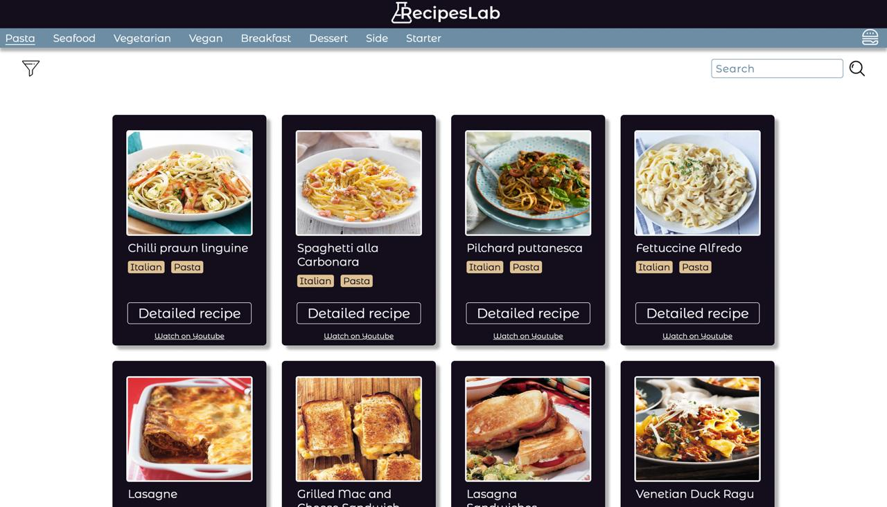
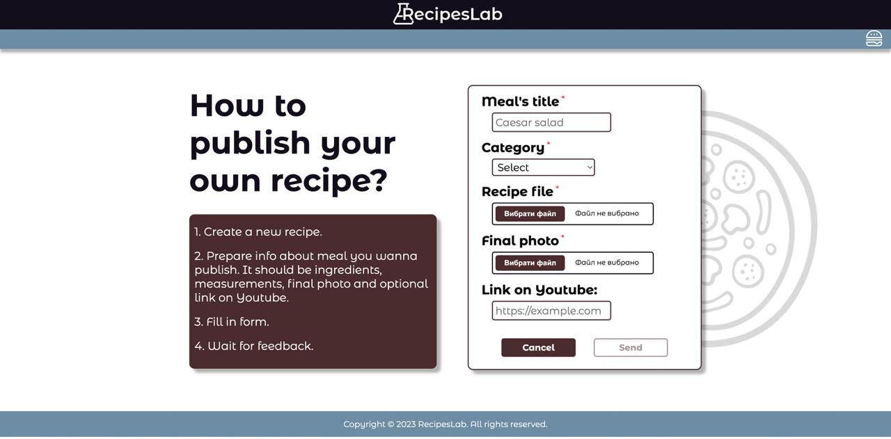
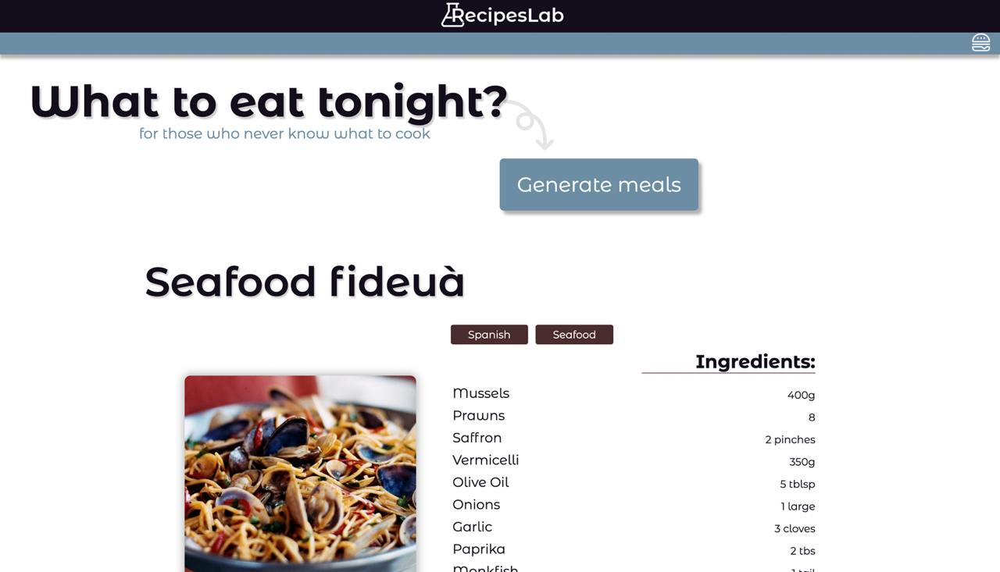

# RecipeLab 
A responsive web application for managing and exploring recipes. Users can search and filter recipes, generate meal suggestions when unsure of what to cook, and submit their own recipes to an admin for publication. 
The project was initially developed using HTML, SCSS, and JavaScript and later rebuilt with Angular, WebSocket integration and Jasmine/Karma testing.

## Project Features

- **Recipe Listing:** Display a variety of recipes with search and filtering capabilities.
- **Meal Generator:** Suggest meals when users are unsure of what to cook.
- **Recipe Submission:** Allow users to send their recipes to the admin's email for potential publication.
- **Modern UI:** Built with responsive design principles for a seamless experience across devices.
- **WebSocket Integration:** Angular version includes real-time updates for recipe submissions.

## Setup

### HTML + SCSS + JS

Switch to branch `lab 2`.
Open `index.html` using Live Server.

### Angular 15

Switch to branch `lab 6`

#### Install dependencies

Run `npm install`

#### Development server

Run `ng serve` for a dev server. Navigate to `http://localhost:4200/`. The application will automatically reload if you change any of the source files.

#### Build

Run `ng build` to build the project. The build artifacts will be stored in the `dist/` directory.

#### Running unit tests

Run `ng test` to execute the unit tests via [Karma](https://karma-runner.github.io).

## Docs Links
- **Angular:** https://angular.dev/
- **WebSocket API:** https://developer.mozilla.org/en-US/docs/Web/API/WebSockets_API
- **SCSS:** https://sass-lang.com/
- **Jasmine:** https://jasmine.github.io/
